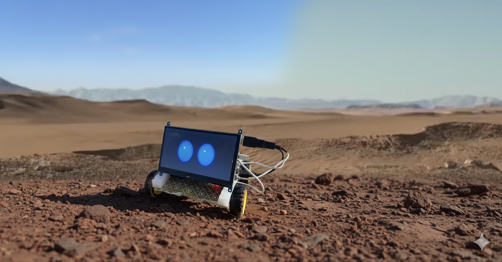

# PuBOT---Portable-Ultra-Robot



# Pubot

**A compact Raspberry Pi–based teleoperated robot with camera streaming and motor control**

> *Short description*: Pubot is a hobbyist Raspberry Pi robot that accepts keyboard (or mouse) control, streams the Pi Camera feed, and drives two DC motors through an L298N (or similar) H-bridge. It’s designed for learning embedded Linux, computer vision, and basic robotics.

---

## Repo status

* **Working prototype** — Core features (drive, camera stream, basic controls) implemented and tested.
* TODO: obstacle detection, PID speed control, autonomous modes, unit tests.

---

## Features

* Keyboard-controlled movement (arrow keys / WASD).
* Optional mouse control (pynput integration).
* Camera streaming using `picamera` / `libcamera` or WebRTC (configurable).
* Motor control using L298N / TB6612 via GPIO (GPIO pin mapping in `HW.md`).
* Basic speed control and safety stop.
* Simple web UI for video and controls (optional).

---

## Hardware (minimal list)

* Raspberry Pi 4 / 3 / Zero 2 W (any Pi with camera support)
* Raspberry Pi Camera Module (v2 / HQ) or USB webcam
* H-bridge motor driver (L298N or TB6612)
* 2 × DC gear motors with wheels
* Chassis (3D printed or hobby chassis)
* Power supply: separate battery for motors (recommended) and 5V supply for Pi (power bank)
* Jumper wires, female/male headers
* Optional: ultrasonic sensor (HC-SR04) for obstacle detection

Create a `HW.md` file in the repo with the exact wiring and photos.

---

## BOM (example)

| Item                   | Qty | Notes                             |
| ---------------------- | --: | --------------------------------- |
| Raspberry Pi 4 Model B |   1 | 2GB or 4GB recommended            |
| Pi Camera Module v2    |   1 | or USB webcam                     |
| L298N Motor Driver     |   1 | or TB6612 for better efficiency   |
| 12V battery pack       |   1 | Motor supply (match motor rating) |
| DC gear motors         |   2 | with wheels                       |
| Chassis                |   1 |                                   |
| Misc wires & screws    |   — |                                   |

---

## Interfacing Diagram - Raspberry Pi with L298N motor


> *Adjust these pins to match your code. Put a photo of the wiring in `docs/wiring.jpg`.*

* Left motor:

  * IN1: GPIO17
  * IN2: GPIO18
  * ENA (PWM): GPIO12
* Right motor:

  * IN3: GPIO22
  * IN4: GPIO23
  * ENB (PWM): GPIO13
* Camera: ribbon cable to CSI port (or USB)
* Safety stop button (optional): GPIO25

Include exact wiring diagrams in `HW.md`.

---

## Software stack

* OS: Raspberry Pi OS (preferably a version with camera support). If you use `bullseye`/`bookworm`/`trixie`, include which camera stack in `HW.md`.
* Language: Python 3.11+
* Key libraries:

  * `RPi.GPIO` / `gpiozero` or `pigpio` for GPIO
  * `picamera2` or `picamera` / `opencv-python` for camera
  * `pynput` for keyboard/mouse remote control (optional)
  * `flask` or `aiohttp` for a simple web server (optional)
  * `uv4l` / WebRTC alternatives (optional advanced)

---

## Installation (quick start)

1. Flash Raspberry Pi OS and enable SSH and camera support.
2. Clone this repository on the Pi:

```bash
git clone https://github.com/<your-username>/pubot.git
cd pubot
```

3. Create a Python virtual environment and install dependencies:

```bash
python3 -m venv venv
source venv/bin/activate
pip install -r requirements.txt
```

4. Edit `config.yaml` to set your GPIO pins and camera backend.
5. Run the teleop script:

```bash
source venv/bin/activate
python3 teleop.py
```

6. (Optional) Start the camera stream server:

```bash
python3 stream_server.py
```

---

## Usage

* Default teleop uses arrow keys or WASD.
* `q` — quit and safely stop motors.
* `s` — emergency stop (motor brake).
* Use `config.yaml` to toggle camera backend and speed limits.

Include sample screenshots or a screencast in `docs/`.

---

## Code structure

```
pubot/
├─ README.md
├─ LICENSE
├─ requirements.txt
├─ config.yaml
├─ teleop.py           # keyboard/mouse control and main CLI
├─ motor_controller.py # low-level motor/gpio interface
├─ stream_server.py    # camera streaming server (flask or aiohttp)
├─ hw/                 # wiring diagrams, photos (HW.md)
├─ docs/               # demo gifs, photos, screenshots
└─ utils/
   ├─ safe_shutdown.py
   └─ sensors.py
```

Keep modules small and well-documented. Add docstrings to every function.

---

## Example: teleop.py (high-level behavior)

```python
# teleop.py (pseudo-code outline)
# - init motor controller
# - init camera (if requested)
# - loop: read keyboard / mouse events -> map to motor speeds
# - gracefully handle exit
```

Add the real file under `teleop.py` — keep the mapping and inversion fixes configurable (e.g. `invert_x: true`).

---

## Tests & Safety

* **Safety first**: always disconnect motors when changing wiring.
* Add a software emergency stop (GPIO or key) that immediately sets PWM to 0.
* Write simple smoke tests for the motor controller logic (mock GPIO in tests).

---

## Troubleshooting

* Motor spins opposite direction: swap motor wiring or set `reverse: true` in `config.yaml`.
* Camera not found: check `raspi-config` camera interface or use `libcamera-hello` / `vcgencmd get_camera`.
* `pynput` install error on Pi (externally-managed env): use venv or `python3 -m pip install --user`.

Document the exact commands that worked for your Pi model in `docs/troubleshooting.md`.

---

## .gitignore (suggested)

```
venv/
__pycache__/
*.pyc
*.log
.env
/secrets/
.DS_Store
*.sqlite3
```

---

## LICENSE

Use an open-source license. Suggested: **MIT License**. Create a `LICENSE` file with the full MIT text. Example short header in each file:

```text
MIT License
Copyright (c) 2025 <Your Name>
```

---

## Contributing

* Add issues for features/bugs.
* Fork -> branch -> pull request.
* Use conventional commits for clearer history (e.g. `feat: add obstacle detection` / `fix: invert motor direction`).

**PR checklist**

* Code runs on Pi
* No changed wiring without HW.md update
* Basic tests added

---

## Release & Changelog template

* `CHANGELOG.md` with `Unreleased` and sections for `Added`, `Changed`, `Fixed`.

---

## Example commit messages

* `feat: add keyboard teleop with arrow-keys and WASD`
* `fix: invert forward/backward motor mapping`
* `chore: add .gitignore and LICENSE`

---

## GitHub tips (pushing to remote)

```bash
git init
git add .
git commit -m "chore: initial pubot prototype"
git branch -M main
git remote add origin https://github.com/<your-username>/pubot.git
git push -u origin main
```

For iterative commits, use feature branches: `git checkout -b feat/camera-webui`.

---

## Future ideas

* Add ultrasonic-based obstacle avoidance
* Add ML-based object tracking (use simple OpenCV tracking or lightweight models)
* Add battery monitor and safe shutdown when voltage is low
* Dockerize the stream server (if using a heavier stack)

---

## Contacts & Attribution

Add your name, email, and a short `MAINTAINERS.md` if you plan to accept outside contributors.

---

### Files to add now (suggested):

* `README.md` (this file)
* `LICENSE` (MIT)
* `requirements.txt` (list all pip packages used)
* `config.yaml` (example pins and defaults)
* `teleop.py`, `motor_controller.py`, `stream_server.py`
* `HW.md`, `docs/demo.gif`, `docs/wiring.jpg`
* `.gitignore`, `CHANGELOG.md`, `CONTRIBUTING.md`

---

*If you want, I can also generate ready-to-copy files (README.md, LICENSE, .gitignore, config.yaml template, and a stub teleop.py and motor_controller.py) and put them here so you can copy into your repo.*

